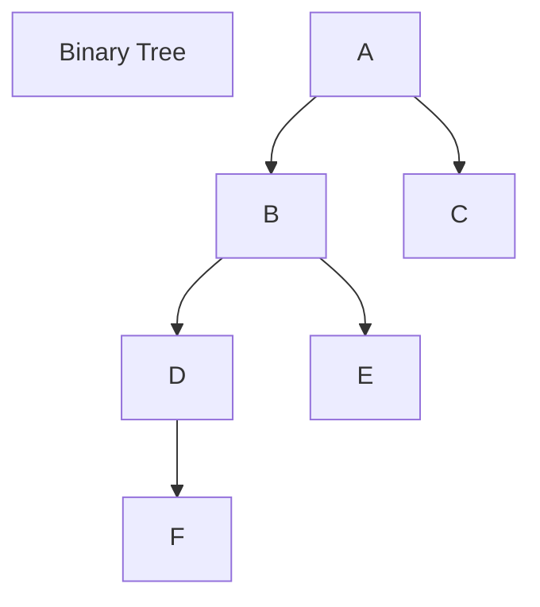
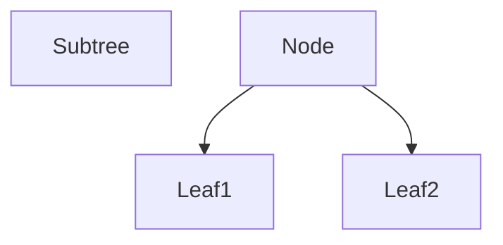
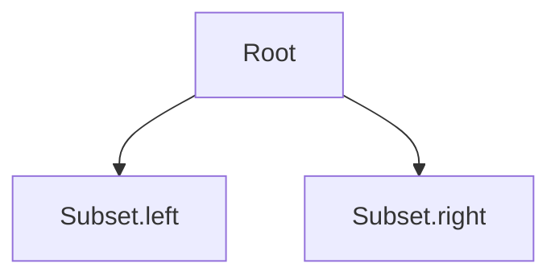

Binary Tree

```ad-note
title: Binary Tree

Maximum number of children a node can have is 2
```

subtree((X)) -> (X) and its descendants ( (X) root)
depth((X)) -> # of ancestors -> # of edges in path from (X) up to root
height((X)) -> # of edges in the longest downward path from (X) -> max. depth in subtree((X))

h -> height(root) -> height(tree)



<u>Traversal Order</u> of nodes/items
for every node (X)

<u>Inorder-Traversal</u>
- nodes in
	- (X).left before (X)        
	- (X).right after (X)

Iterative Inorder-traversal: Pseudocode  
```python
iter((X))
	iter((X).left)
	output (X)
	iter((X).right)
```
Time Complexity: Linear Time O(n)
<u>Traversal order</u>:




which comes first in traversal order within subtree(node)
- <u>Subtreefirst</u>.(node)
	- Go left  (node = node.left) until would fall off the tree (node == Node)
	- return node
	- Time Complexity: O(h)
- <u>Successor</u>(node): next after node in tree's traversal order 
	- if node.right: return subtreee_first(node.right)
	- else: walk up the tree (node = node.parent) until we go up a left branch (node == node.parent.left)
	- return node
	- Time Complexity: O(h)
- <u>Subtree_insert_after</u>(node.new):
	- if no node.right put new node there
	- else: put new as successor(node).left
	- Time Complexity: O(h)
- <u>Subtree_delete</u>(node): 
	- if node is a leaf: detach from parent
	- else: 
		- if node.lead:  swap node.item <--> predecessor(node).item; subtree.delete(predecessor)
			- if  node.right:
	- Time Complexity: O(h)
- <u>Sequence</u>:  (no keys)
	- traversal.order = sequence order 
	- <u>Size</u>(node) = # of nodes in subtree(node)
		- return node.size
- <u>Set</u>: (BST) (has keys)
	- traversal.order = increasing item.key
	- BST Property:
		- keys in subtree(node.left)
		- node.item.key 
		- keys in subtree(node.right)
	- find(k)
	- find.prev
	- find.next
<u>Subtree_find</u>(node.k): (set order) (has keys)
- if node is None; return 
- if k < node.item.key:
	- recurse on node.left
- if =: return node 
- if >: recurse on node.right

<u>Subtree_at</u>(node, i ): (sequence order) (no keys)
- N<sub>L</sub> = size(node.left) (Subtree augmentation)
- if i < n = subtree_at(node.left.i)
- if i == n: return node
- if i > n<sub>L</sub>: substree(node.right.i - n<sub>L</sub> - 1)


Subtree augmentation
- each node can store O(1) extra fields/properties 
- <u>Subtree Property</u> node can be computed from properties of node's children (and node) in O(1) time
- node.size = node.left.size + node.right.size + 1 
- Insert/delete -> in end, add or remove <u>leaf</u> of tree
- update O(h) ancestors in order up the tree



<u>Subtree Properties</u>:
- Sum, Product, min, max  of some feature of every node in subtree
- NOT maintain node's index, depth 

O(h) -> o(log(n))
<u>h = O(log(n))</u>: <u>balanced</u> binary tree
<u>AVL tree maintain</u>
<u>height balance</u>: 
- height(node.right) - height(node.left) {-1, 0, +1}


<u>Rotation</u>: 
![[Binary tree rotation visualization.png]]
left.rotate(x)

<u>Height balance => Balanced</u>:
- N<sub>h</sub>  = N<sub>h-1</sub> + N<sub>h-2</sub> + 1
	- >N<sub>h-2</sub>  + N<sub>h-2</sub> 
	-  = 2 x N<sub>h-2</sub>  = 2<sup>[h/2]</sup> = h <= 2log(n)
- node.height = 1 +max {node.left.height, node.right.hight}
![[Heigh Balance tree.png]]

- consider lowest unbalanced node X => skew in {+2, -2}
- <u>case 1</u>: skew(y) = 1
- <u>case  2</u>: skew(y) = 0
- <u>case  2</u>: skew(y) = -1


![[AVL Tree Rotations.png]]
